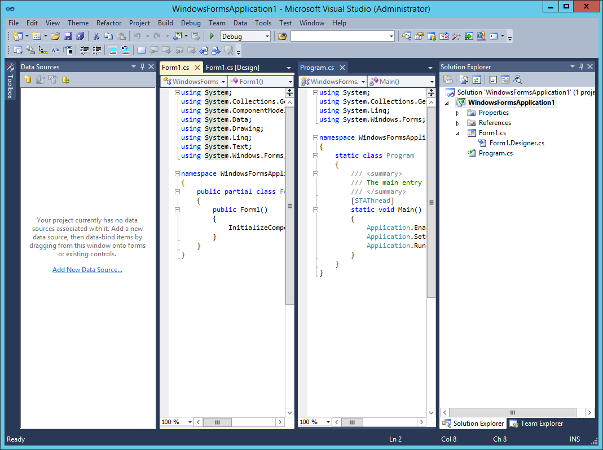
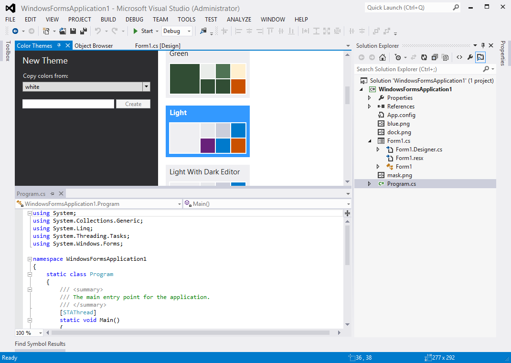
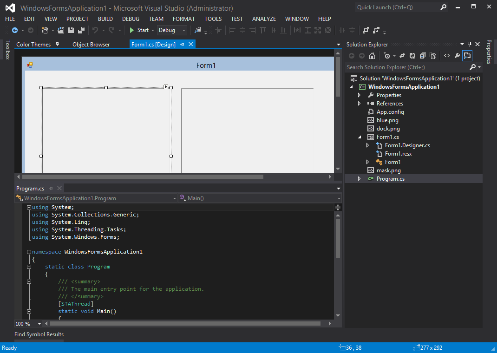
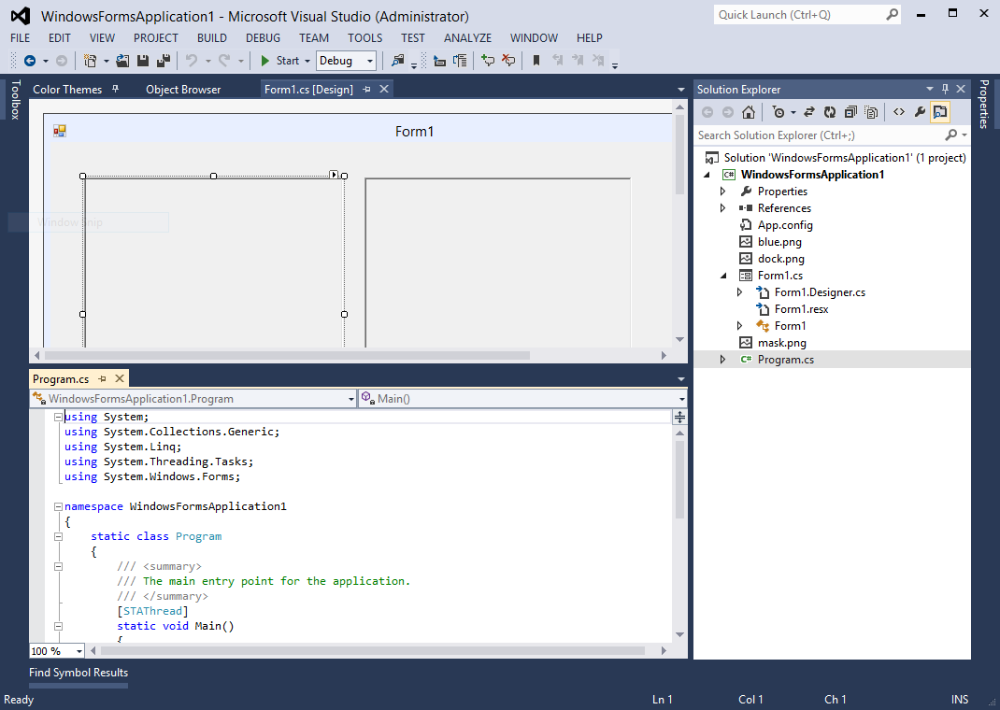
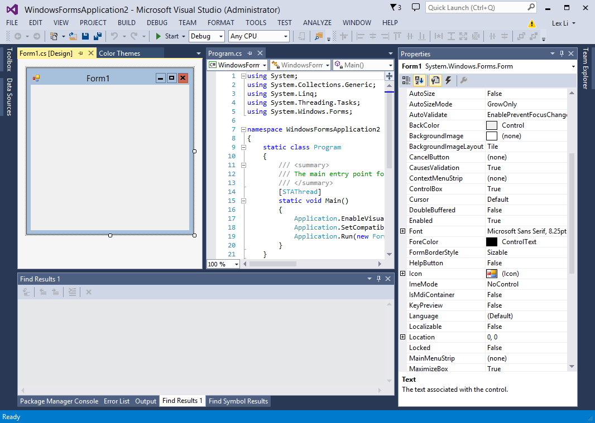
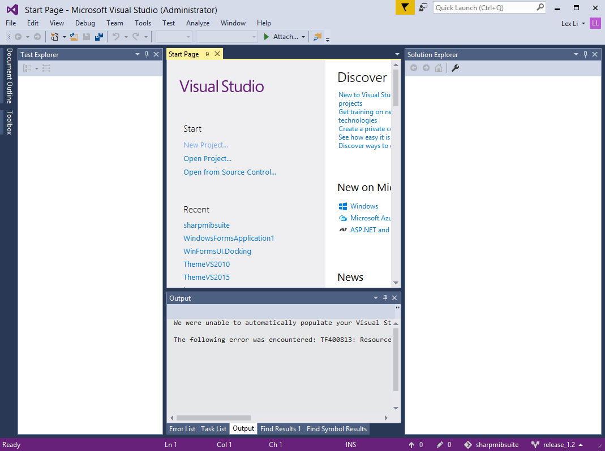
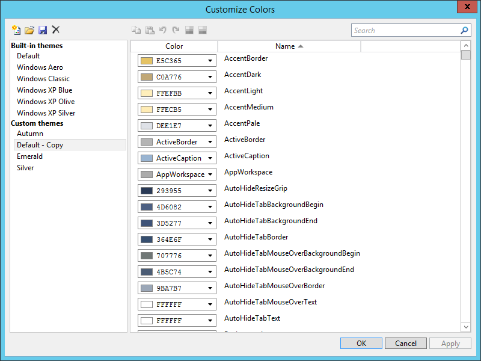
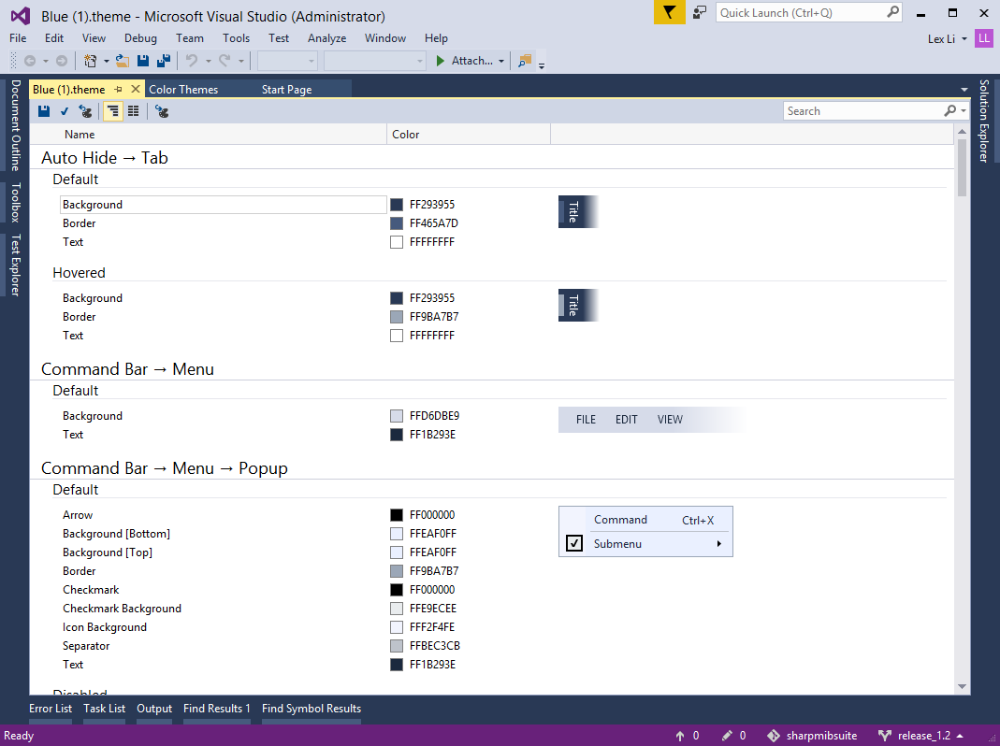

Review on Visual Studio Themes
==============================
By `Lex Li`_

This page provides a review on Microsoft Visual Studio themes. DockPanel Suite themes follow the look-and-feel.

.. contents:: In this article
   :local:
   :depth: 1

Visual Studio 2010 Blue Theme
-----------------------------
Microsoft gave up Windows Forms and built Visual Studio 2010 mainly on WPF. That instantly led to a brand new theme being shipped,

   Figure 1: Visual Studio 2010 Blue Theme

It reassembles many elements of Visual Studio 2008 themes, such as rounded rectangles and icons in auto-hide tabs and tool window tabs, 
but also features new elements,

* Gradient effect is almost removed.
* More colors are utilized (especially when a visual element is hovered or pressed by mouse).
* Document tabs have close buttons.
* Dock target indicators are transparent.

Visual Studio 2012 Themes
-------------------------
When Microsoft designed Visual Studio 2012, they came across the idea to ship a light theme, as well as a dark theme, instead of 
the blue theme of Visual Studio 2010.

   Figure 2: Visual Studio 2012 Light Theme

   Figure 3: Visual Studio 2012 Dark Theme

There are lots of visual effect changes compared to Visual Studio 2010,

* Icons are removed from auto-hide strips.
* Auto-hide tabs, tool window, document tabs use simple rectangles instead of rounded.
* Separators are used in tool window tabs.
* Vertical splitters use a blurring effect to distinguish from horizontal ones.

By community request, in a later Update, the blue theme was also added back.

   Figure 4: Visual Studio 2012 Blue Theme

The noticeable changes in the blue theme are,

* Its inactive selected document tab is rendered with two blue colors. (the light and dark themes do not use this feature.)
* Its vertical splitters are rendered the same as the horizontal ones.

Visual Studio 2013 Themes
-------------------------
Visual Studio 2013 ship all three themes by default (light, dark, and blue).

   Figure 5: Visual Studio 2013 Blue Theme

This time only small changes are introduced,

* A few colors have changed in the palette.
* Tool window tab separators are removed.
* Tool windows and documents use borders.
* Splitters follow Visual Studio 2012 blue theme style.

Visual Studio 2015 Themes
-------------------------
Visual Studio 2015 ship all three thems by default (light, dark, and blue).

   Figure 6: Visual Studio 2015 Blue Theme

This time except a few color changes in the palette, the look-and-feel is almost the same as Visual Studio 2013.

Visual Studio Color Theme Manager
---------------------------------
During Visual Studio 2010 development, an extension was released by Microsoft for end users to design their own themes,

https://blogs.msdn.microsoft.com/visualstudio/2010/01/04/changing-visual-studios-color-palette/

   Figure 7: Color Theme Manager for Visual Studio 2010

It can import/export themes to .vstheme files in XML format.

Starting from Visual Studio 2012, .vstheme files use a completely new schema, and Color Theme Manager changes to a new design,

   Figure 8: Color Theme Manager for Visual Studio 2012 and Above

Related Resources
-----------------

- :doc:`/getting-started/installing-on-windows`
- :doc:`/tutorials/basics`
- :doc:`/themes/creating-new-theme`
- :doc:`/themes/existing-themes`
